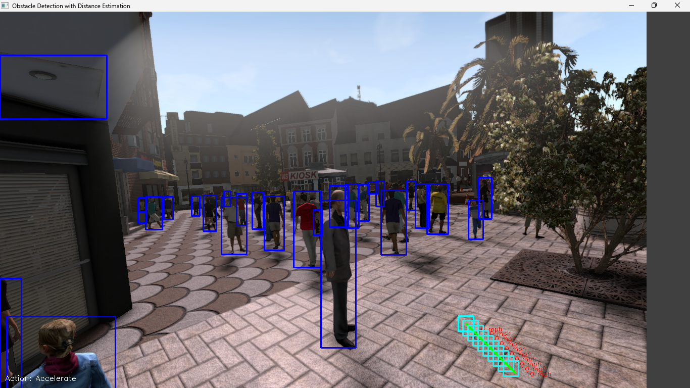

# Advanced-Obstacle-Detection-and-Trajectory-Planning-for-Autonomous-Flying-Robots
This project demonstrates a sophisticated AI-driven system for autonomous flying robots, featuring real-time obstacle detection, dynamic trajectory planning, and adaptive speed control. It enhances safety and efficiency in navigation, showcasing advanced applications in autonomous driving, robotics, and computer vision.

## Overview

This project showcases a cutting-edge solution for autonomous navigation in dynamic environments, leveraging advanced AI and computer vision technologies. Our system is designed to enhance the safety and efficiency of flying robots by integrating real-time obstacle detection, collision avoidance, and trajectory planning.

## Problem Statement

In dynamic environments, autonomous flying robots face challenges in safely navigating through obstacles while maintaining efficient trajectory planning. The primary objective of this project is to develop a robust system that enables flying robots to detect obstacles in real-time and plan their future trajectory to avoid collisions while optimizing their speed and path.

## Assumptions

- **Robot Capabilities**: The robot can fly up and down, move in all four horizontal directions (forward, backward, left, right), and adjust its speed dynamically.
- **Speed Range**: The robot's speed is limited to a range of 0 to 10 mph to ensure safe navigation.
- **Environment**: The environment is assumed to be a 3D space with potential obstacles that the robot must navigate around.

## Algorithm

The algorithm implemented in this project involves several key components:

1. **Obstacle Detection**: 
   - Utilizes a pre-trained Faster R-CNN model to detect obstacles in RGB images.
   - Processes images to identify bounding boxes around detected obstacles.

2. **Distance Estimation**:
   - Calculates the average depth within each detected bounding box using depth maps from the SYNTHIA dataset.

3. **Decision Making**:
   - Determines actions (accelerate, decelerate, maintain) based on the distance to the nearest obstacle and current speed.
   - Uses a safe stopping distance calculation to ensure collision avoidance.

4. **Trajectory Prediction**:
   - Predicts the future positions and speeds of the robot over the next 50 states.
   - Ensures that all predicted steps are collision-free by checking against detected obstacles.

5. **Visualization**:
   - Displays the robot's trajectory with green lines and marks the bounding box and speed at intervals along the path.
   - Provides a visual representation of the robot's planned path and speed adjustments.

## Analysis of the Algorithm

### Obstacle Detection
- Successfully detects multiple objects such as vehicles and pedestrians with blue bounding boxes.
- Covers a wide area, effectively capturing both large and small objects.

### Trajectory Planning
- Green lines indicate predicted trajectory, navigating through the environment while avoiding obstacles.
- Red text represents speed annotations at specific intervals.

### Action Decision
- "Action: Accelerate" suggests safe conditions for increasing speed based on current distances and trajectory predictions.

### Interpretation
- **Effectiveness**: The algorithm effectively identifies obstacles and plans a safe trajectory.
- **Decision Logic**: Acceleration decisions indicate perceived clear paths ahead.
- **Visualization**: Bounding boxes and trajectory lines provide clear visual representations of detected obstacles and planned movements.

### Recommendations
- **Fine-tuning Detection**: Ensure accurate detection of all relevant obstacles, especially near the planned path.
- **Trajectory Adjustments**: Verify that predictions consistently avoid all obstacles in complex environments.
- **Action Validation**: Regularly validate decision logic for appropriate actions given obstacle proximity and movement.

## Features

- **Real-Time Obstacle Detection**: Utilizes state-of-the-art machine learning algorithms to identify and classify obstacles using sensor data.
- **Dynamic Trajectory Planning**: Employs predictive modeling to simulate future paths, allowing proactive course adjustments.
- **Scalable AI Integration**: Built on a scalable AI framework adaptable for various autonomous systems.

- ## SYNTHIA Dataset

I utilized the [SYNTHIA dataset](https://www.kaggle.com/datasets/tzokas027/synthia) for training and testing my model. This dataset is known for its synthetic images that provide detailed annotations for various urban scenes.

### Structure

The SYNTHIA dataset is organized into several folders, each containing different types of data:

- **RGB**: Contains color images that simulate real-world urban environments.
- **Depth**: Provides depth maps corresponding to each RGB image, useful for distance estimation.
- **GT (Ground Truth)**: Includes semantic segmentation masks that label different objects within the scene.

### Sample Image

A typical sample from the SYNTHIA dataset includes an RGB image paired with its corresponding depth map and ground truth segmentation. This comprehensive data allows for robust training of models in tasks such as object detection and depth estimation.

 <!-- Add a sample image from the dataset here -->

## Results

